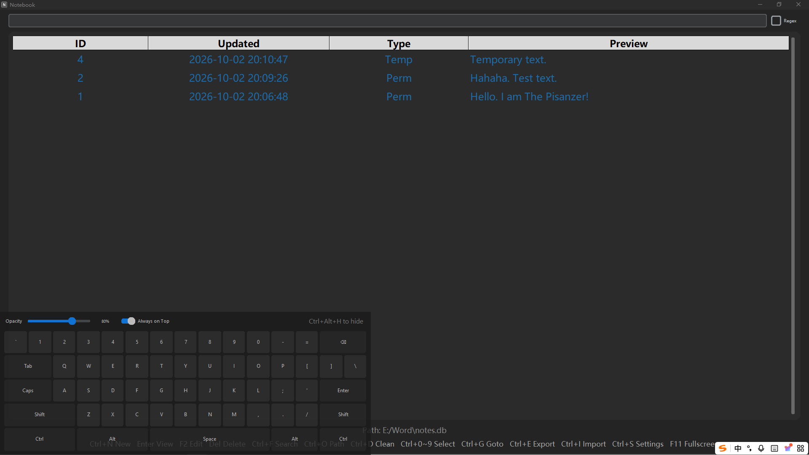

# Keyboard

A flat, dark-themed on-screen keyboard for Windows.

Click the keys, and they type into whatever window is focused — no driver, no IME, no ads. Just a lightweight key simulator.

> Part of the **Elemental Series** — small, keyboard-driven, dark-themed desktop tools.



## Features

- Flat, dark UI built with CustomTkinter
- Click to type into any focused window (does not steal focus)
- Opacity slider (30% – 100%)
- Always-on-Top toggle
- Global hotkey `Ctrl+Alt+H` to show / hide
- Shift and Caps Lock support, with live highlight
- Lives in the bottom-left corner, out of the way

## What It Is Not

- **Not an IME.** It does not type Chinese, does not predict words, does not connect to the internet.
- **Not a replacement for your physical keyboard.** It's a fallback, an accessibility aid, or an emergency tool.

## Requirements

- Windows (uses `user32.dll`)
- Python 3.10+
- `customtkinter`
- `keyboard` (optional, only for the global hotkey)

## Install

```bash
pip install customtkinter keyboard
```

## Run

```bash
python keyboard.py
```

## Build exe

```bash
pyinstaller --onefile --noconsole ^
  --collect-all customtkinter ^
  --hidden-import keyboard ^
  --add-data "keyboard_icon.ico;." ^
  --icon="keyboard_icon.ico" ^
  --name=Keyboard keyboard.py
```

## Shortcuts

| Key | Action |
|-----|--------|
| Ctrl+Alt+H | Show / Hide the keyboard |

## Notes

- The `keyboard` library may require **administrator privileges** to register the global hotkey. If it fails, the app automatically falls back to a `Hide` button.
- Some antivirus software may flag the `keyboard` library, since it listens to global key events. Whitelist it if needed.
- If the taskbar icon still shows the default Python feather after rebuilding, restart Windows Explorer to refresh the icon cache.
- The window uses `WS_EX_NOACTIVATE` so it does not steal focus. If characters don't reach the target window, try restarting the app.

## Changelog

### v1.0.0
- First release
- Flat, dark UI
- Click to type into any focused window
- Opacity slider and Always-on-Top toggle
- Global hotkey `Ctrl+Alt+H` to show/hide

## Elemental Series

| Element | Project | Status |
|---------|---------|--------|
| N | Notebook | ✅ |
| K | Keyboard | ✅ |
| T | Timer | 🚧 |

## License

AGPL-3.0